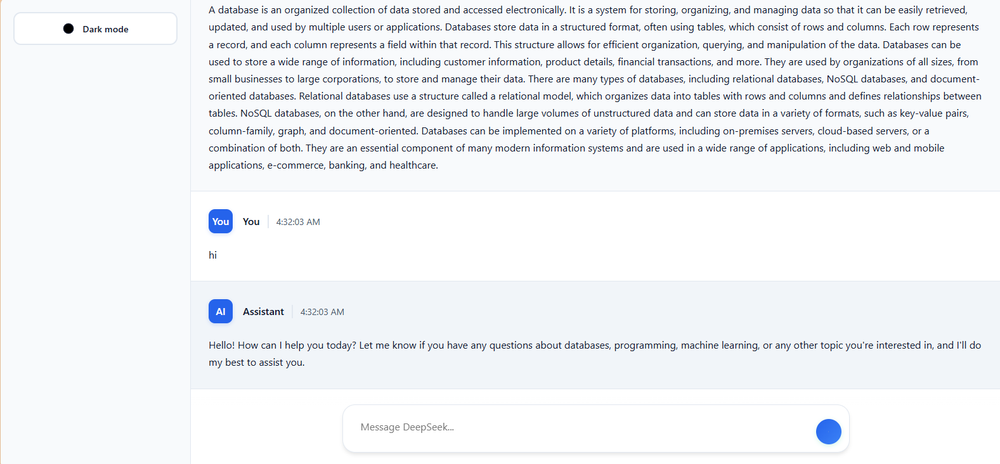
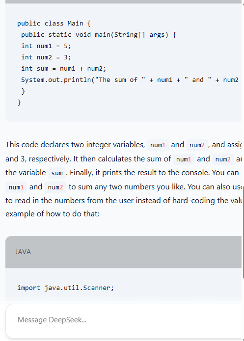
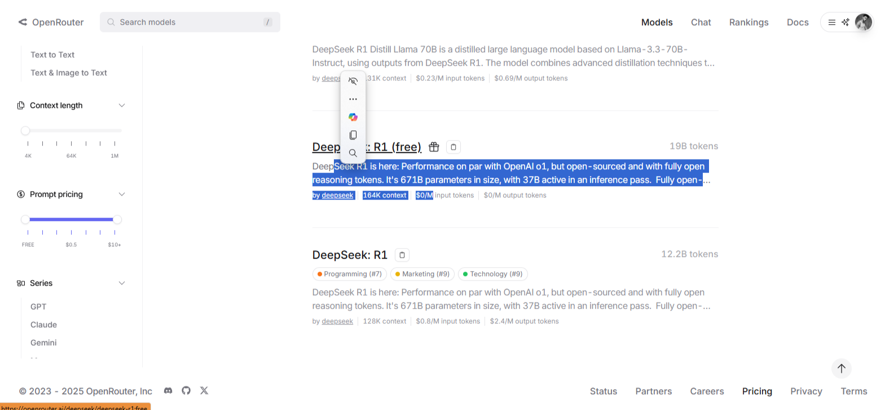
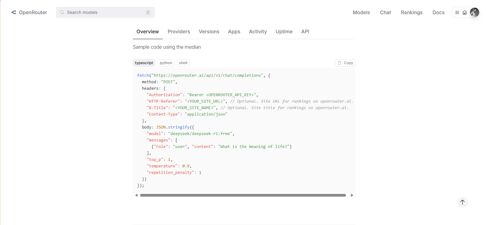
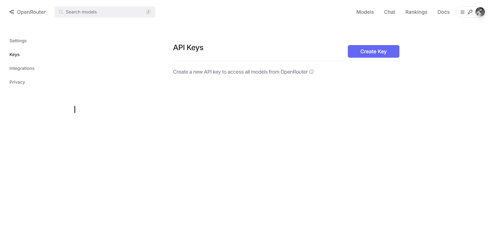

      <h1>  DeepSeek AI Chat</h1>
      <h3>An Advanced AI Chat Interface Powered by DeepSeek</h3>

    
    
    

# 📌 Overview

DeepSeek AI Chat is a modern chat interface that leverages the power of DeepSeek's AI models. It provides an intuitive platform for users to interact with advanced AI, featuring code highlighting, dark mode, and responsive design.

# 🛠️ Tech Stack

## 📸 Screenshots

  <!-- Main Interface - Dark Theme -->
  <h4>Desktop Interface - Dark Theme</h4>
  
  
  
  
    

  <!-- Main Interface - Light Theme -->
  <h4>Desktop Interface - Light Theme</h4>
  
  
  
  
  
    

  <!-- Mobile Views -->
  <h4>Mobile Interface</h4>
  

    
    
    
    
    
    
  

  <!-- Integration & Features -->
  <h4>Integration Features</h4>
  
  
  
    

  <!-- API & Configuration -->
  <h4>API & Setup</h4>
  
  
  
  
    

  <!-- Analytics & Activity -->
  <h4>Analytics & Performance</h4>
  
  
  

## 🔑 Key Features

### Chat Interface

- Real-time AI responses
- Code syntax highlighting
- Markdown support
- Copy code functionality
- Message history
- Loading states and animations

### Theming

- Dark/Light mode toggle
- Smooth theme transitions
- Custom color schemes
- Responsive design

### Technical Features

- Local storage persistence
- Error handling
- Mobile responsiveness
- Code formatting
- Typing indicators

## 🚀 Getting Started

1. Clone the repository
