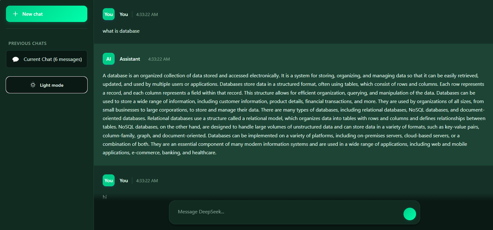
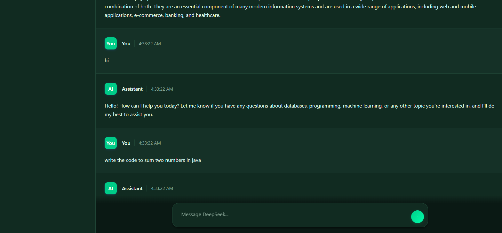
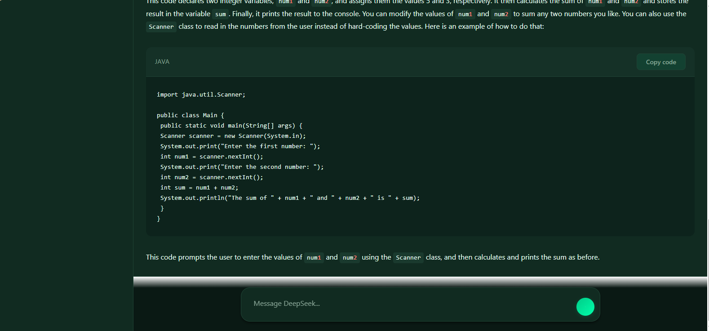
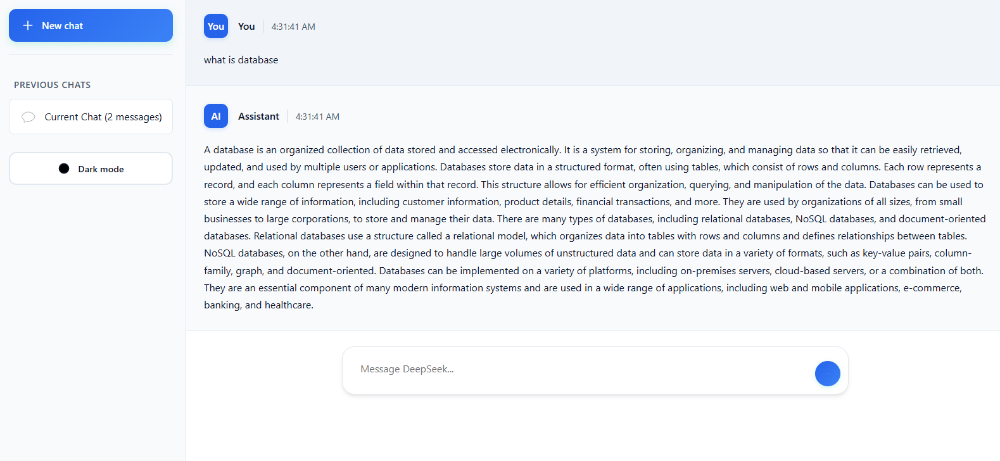
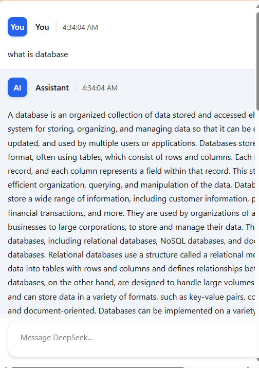

      <h1>  Travel Blog Platform</h1>
      <h3>A Modern Travel Blogging Community</h3>

    
    
    

# 📌 Overview

Travel Blog is a dynamic web platform that connects travel enthusiasts and bloggers. Users can share their travel experiences, engage with other travelers through likes and comments, and manage their content through an intuitive interface.

# 🛠️ Tech Stack

## 📸 Screenshots

### API Configuration

  

### Blog Dashboard

  
  

### Content Creation

  
  

### User Management

  
  

### Engagement Features

  

### Admin Dashboard

  

### Additional Screenshots

  
  
  
  
  
  
  
  
  
  
  
  
  
  
  
  
  
  
  
  
  
  
  
  
  

## 🔑 Key Features

### For Bloggers

- Create and publish travel blogs
- Upload images and rich text content
- Engage with readers through comments
- Track post engagement (likes, comments)
- Choose between Basic and Pro subscription plans

### For Administrators

- Approve new blogger applications
- Monitor platform statistics
- Manage user accounts
- Review content moderation

### General Features

- Responsive design
- User authentication
- Social interactions (likes, comments)
- Real-time updates
- Image upload support

## 👨‍💻 Developer Contact

Feel free to reach out for questions or collaboration:

- GitHub: [@jamalihassan0307](https://github.com/jamalihassan0307)
- LinkedIn: [Jamali Hassan](https://www.linkedin.com/in/jamalihassan0307/)

## 🙏 Acknowledgments

Special thanks to:

- MockAPI for backend services
- Font Awesome for icons
- All contributors and supporters
